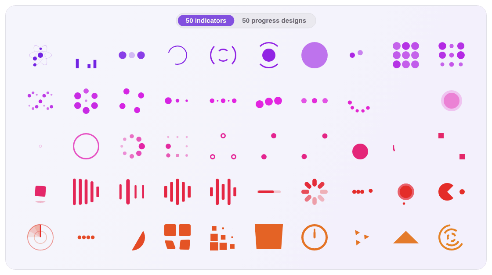

# LoaderKit

Loading indicators described as data and rendered natively on Android, iOS, macOS, Windows and the web.

<p align="center">
  <a href="https://maitrungduc1410.github.io/loader-kit/guide/indicators">
    <picture>
      <source media="(prefers-color-scheme: dark)" srcset="docs/public/readme/indicators-dark.gif">
      
    </picture>
  </a>
</p>

<p align="center">
  All 33 built-in indicators. <a href="https://maitrungduc1410.github.io/loader-kit/guide/indicators">Open the gallery</a> to try them with your own colors, size and speed, or build a new one in the <a href="https://maitrungduc1410.github.io/loader-kit/tools/playground">playground</a>.
</p>

Each indicator is a small JSON spec: elements laid out in a unit box, and keyframe tracks for
their scale, opacity, rotation and translation. Every platform engine reads the same spec and
follows the same rules ([SPEC.md](SPEC.md)), checked against a shared conformance suite
([test-vectors/](test-vectors)), so an indicator looks and moves the same everywhere. There are 33 built-in
indicators, some with params (`count`, `minScale`), and you can write your own (experimental).

**Documentation, live demos and the playground: https://maitrungduc1410.github.io/loader-kit/**

| Platform | Package | Install |
| --- | --- | --- |
| Android (View, Jetpack Compose) | `io.github.maitrungduc1410:loaderkit-core`, `loaderkit-compose` | Maven Central, [docs](https://maitrungduc1410.github.io/loader-kit/platforms/android) |
| iOS, macOS (UIKit, AppKit, SwiftUI) | `LoaderKit` | Swift Package Manager or CocoaPods `:git`/`:tag`, [docs](https://maitrungduc1410.github.io/loader-kit/platforms/apple) |
| Windows (WinUI 3) | `LoaderKit.WinUI`, `LoaderKit.Core` | NuGet, [docs](https://maitrungduc1410.github.io/loader-kit/platforms/windows) |
| Web (React, Vue, Svelte, custom element) | `@loader-kit/web` | npm, [docs](https://maitrungduc1410.github.io/loader-kit/platforms/web) |
| JavaScript / TypeScript | `@loader-kit/spec` | npm: schema, `defineIndicator`, validator, reference evaluator |
| React Native | [`react-native-loader-kit`](https://github.com/maitrungduc1410/react-native-loader-kit) | npm |

All packages share one version; tags look like `1.0.0`.

## Quick look

Android:

```kotlin
val loader = LoaderKitView(context).apply {
    indicator = "BallPulse"
    params = mapOf("count" to 5.0)
    color = Color.WHITE
}

// Jetpack Compose
LoaderKitIndicator("BallSpinFadeLoader", Modifier.size(48.dp), color = Color.White, speed = 1.5)
```

iOS and macOS:

```swift
let loader = LoaderKitView(indicator: "BallPulse")
loader.params = ["count": 5]

// SwiftUI
LoaderKitIndicator("SquareSpin").color(.white).speed(0.5)
```

Windows:

```xml
<lk:LoaderKitIndicator Indicator="BallPulse" Color="White" Speed="1.5" />
```

Web (React shown; Vue and Svelte take the same props from `@loader-kit/web/vue` and `@loader-kit/web/svelte`):

```tsx
import { LoaderKit } from '@loader-kit/web/react';

<LoaderKit indicator="BallSpinFadeLoader" color="#7c3aed" speed={1.5} />
```

Plain HTML:

```js
import '@loader-kit/web/element'; // registers <loader-kit>
```

```html
<loader-kit indicator="BallSpinFadeLoader" color="#7c3aed" speed="1.5"></loader-kit>
```

## Learn more

- [Getting started](https://maitrungduc1410.github.io/loader-kit/guide/getting-started): install and a first indicator on every platform.
- [Built-in indicators](https://maitrungduc1410.github.io/loader-kit/guide/indicators): all 33, live, with copyable code.
- [Custom indicators](https://maitrungduc1410.github.io/loader-kit/spec/): write your own spec, step by step. Experimental: until the schema is declared stable, a minor release may change it. Built-in indicators are not affected.
- [Playground](https://maitrungduc1410.github.io/loader-kit/tools/playground): edit a spec with live preview and validation.

## Contributing

See [CONTRIBUTING.md](CONTRIBUTING.md) for the layout of the repository, the checks and how
releases work.

## License

MIT, see [LICENSE](LICENSE). The motion of the built-in indicators comes from
NVActivityIndicatorView, loaders.css and DGActivityIndicatorView, see
[THIRD_PARTY_NOTICES.md](THIRD_PARTY_NOTICES.md).
